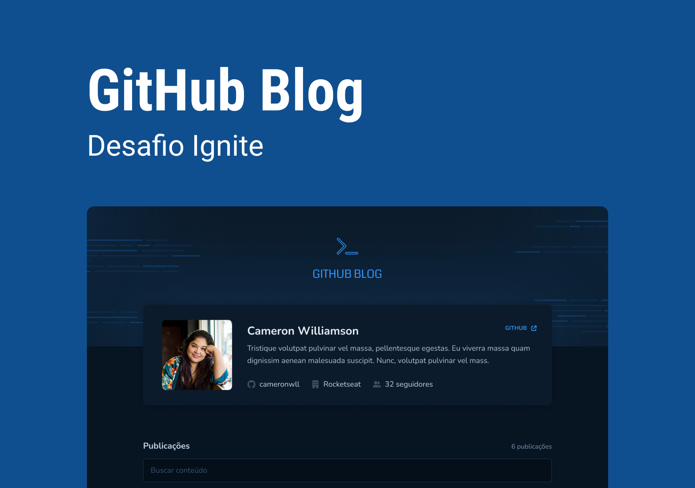

# GitHub Blog

<p align="center">
  
  
</p>
<br>

O GitHub Blog é um blog desenvolvido em cima da API do GitHub. Desse modo os posts do blog são criados por meio das issues do próprio repositório e carregados através da API REST do GitHub.

Além disso é possível filtrar os posts por meio de uma busca de palavras-chave no titulo ou corpo do post.

<div align="center">
  
</div>

## Extras

Foram adicionadas algumas funcionalidades além do proposto durante o ignite:

- [ ] Responsividade
- [ ] Página 404

## Getting Started

Para executar esse projeto será necessário ter o [Node.js](https://nodejs.org/) e o [npm](https://www.npmjs.com/) instalados.

Configure as variáveis de ambientes de acordo com o exemplo do arquivo [.env.example](.env.example) para carregar as informações do repositório desejado.

Instale as dependências:

```shell
npm i
```

Inicie a aplicação:

```shell
npm run dev
```

## Tecnologias

- [date-fns](https://date-fns.org/)
- [ESLint](https://eslint.org/)
- [React Hook Form](https://react-hook-form.com/)
- [React Router](https://reactrouter.com/en/main)
- [ReactJS](https://reactjs.org/)
- [Styled Components](https://styled-components.com/)
- [Typescript](https://typescriptlang.org/)
- [Vite](https://vitejs.dev/)
- [Zod](https://zod.dev/)

## Licença

Este projeto está licenciado sob o MIT. Consulte a [licença](LICENSE) para mais informações.
